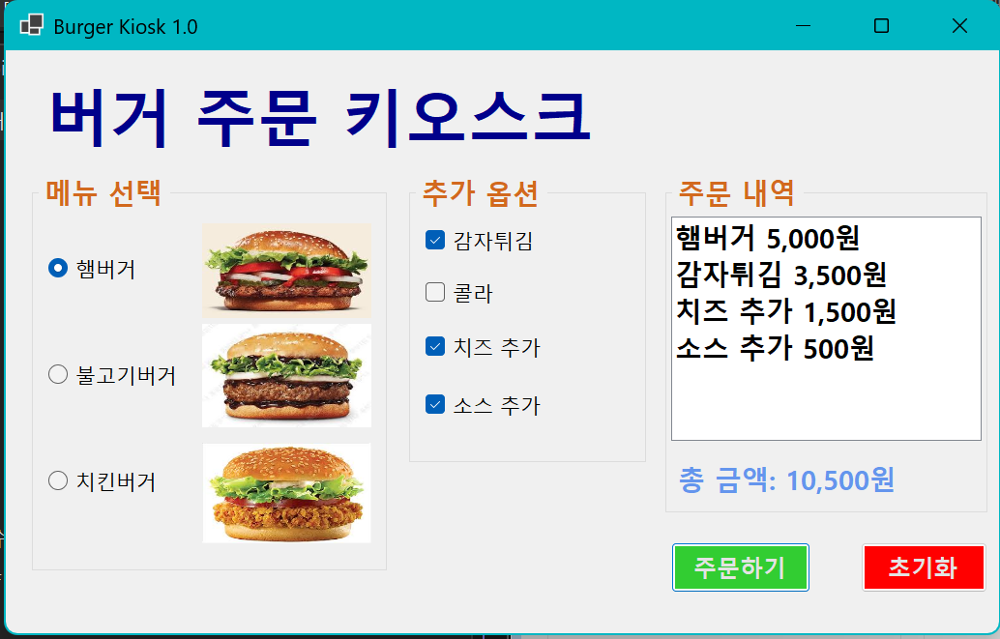
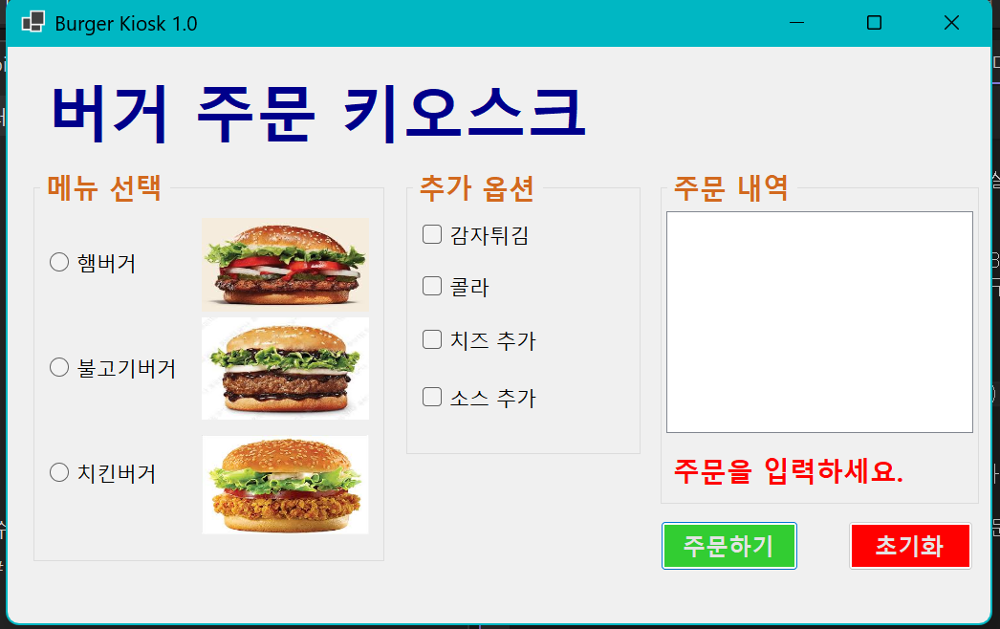

# (C# 코딩) 버거 주문 키오스크

## 개요
- C# 프로그래밍 학습
- 1줄소개: 아이디와 패스워드를 입력해야 하는 로그인 화면
- 사용한플랫폼: 
	- C#, .NET Windows Forms, Visual Studio, GitHub
- 사용한컨트롤:
	- GroupBox, RadioButton, CheckBox, ListBox Button, Label
- 사용한기술과구현한기능:
	- Visual Studio를이용하여UI 디자인
	- 논리 연산자 사용으로 로그인 성공 여부 확인

- 수업중에 배우고 사용했던 클래스들 관련된 설명
	- 
	- 
- 실습중에 구현한 기능들 설명
	- 
	- 

## 실행화면 (과제1)
-과제1코드의실행스크린샷

- 과제내용
	- 컨트롤 배치와 기본적인 속성 설정
	- 선택된 항목 추출 기능 구현
- 구현 내용과 기능 설명
	- UI 구성 (RadioButton과 CheckBox등을 적절히 배치 /Group Box로 적절히 그룹으로 묶음.)
	- 주문하기 버튼과 초기화 버튼 구현 (주문내역 및 총 금액 표시/ 다시 주문 할 수 있게 초기화)

## 실행화면(과제2)
- 과제2코드의실행스크린샷

- 과제내용
	- 아무것도 선택하지 않고 주문하기 버튼 누를 시 에러 메시지 출력
- 구현내용과기능설명
	- 주문하기 버튼을 눌렀을 때 주문이 없을 경우 총 금액 표시를 에러 메시지로 대체.